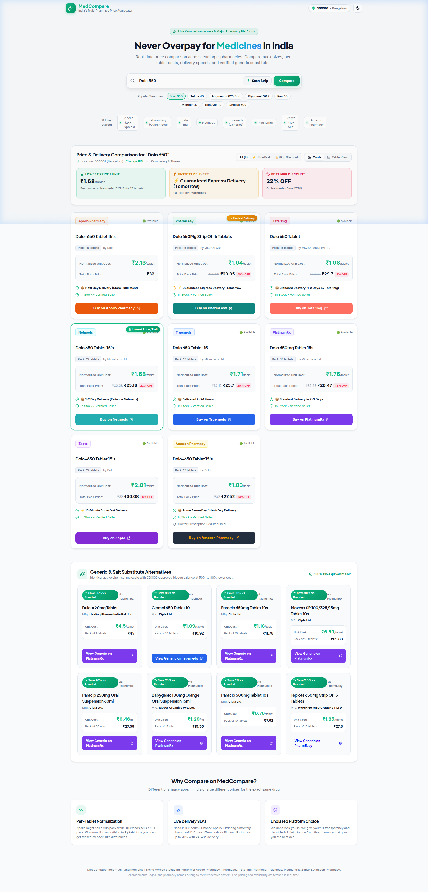
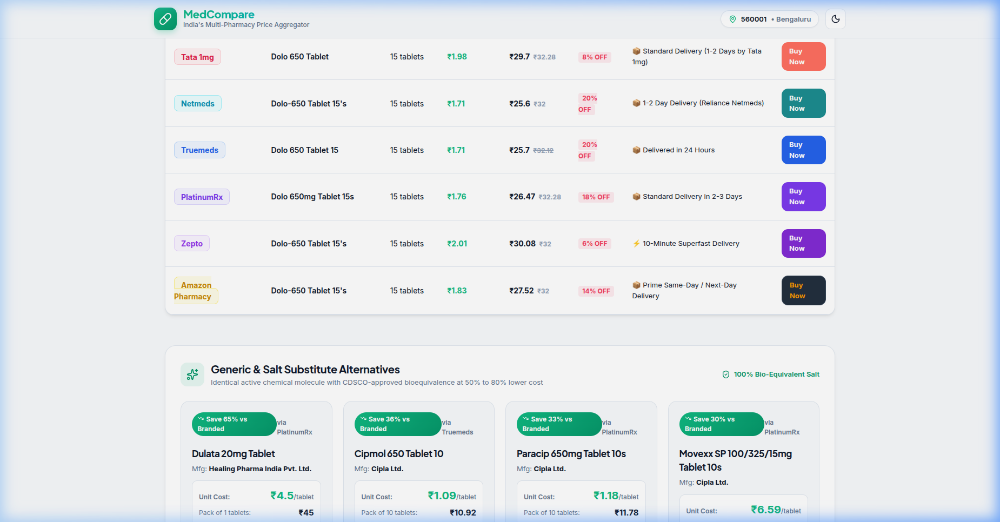

# MedCompare India 💊🇮🇳

> **Real-time Medicine Price, Pack Size & Delivery Speed Comparison Engine across 8 Leading Indian Pharmacy Platforms.**

Never overpay for medicines in India. MedCompare aggregates, normalizes, and compares prices across **Apollo Pharmacy**, **PharmEasy**, **Tata 1mg**, **Netmeds**, **Truemeds**, **PlatinumRx**, **Zepto**, and **Amazon Pharmacy**.



---

## 🚀 Key Features

- **8-Platform Unified Comparison**: Simultaneous real-time query across 8 major Indian e-pharmacies and quick-commerce providers:
  - **Apollo Pharmacy**: Live API gateway with 2-hour express delivery.
  - **PharmEasy**: Live search API with guaranteed delivery and DAM imagery.
  - **Tata 1mg**: Live autocomplete catalog API with detailed manufacturer and drug composition info.
  - **Netmeds**: Live Reliance fulfillment SSR catalog integration.
  - **Truemeds**: Generic specialist with salt alternative matching.
  - **PlatinumRx**: Chronic savings engine offering up to 70% discounts.
  - **Zepto**: 10-Minute quick-commerce delivery.
  - **Amazon Pharmacy**: Prime same-day / next-day delivery (Node 18049712031).

- **Normalized Unit Pricing (₹ / tablet, ₹ / ml)**: Pack sizes vary widely across platforms (10s, 15s, 30s). MedCompare normalizes all prices to per-tablet or per-ml costs so you can accurately compare value.

- **Fastest Delivery & Best Deal Badges**:
  - 🏆 **Lowest Price / Unit** (Best value per tablet)
  - ⚡ **Fastest Delivery** (10-minute / 2-hour express identification)
  - 🏷️ **Best MRP Discount** (Highest percentage savings)

- **Side-by-Side Table & Cards View**: Switch seamlessly between visual cards and a compact comparison table with quick filters (**All 8 Stores**, **⚡ Ultra-Fast**, **🏷️ High Discount**).

- **Generic & Salt Substitute Recommendations**: Identifies CDSCO-approved bio-equivalent generic molecules that offer 50% to 80% savings over branded drugs.

- **Medicine Strip & Packaging Photo Scanner**: Upload a photo of any medicine strip or box. The system extracts brand names and active compositions using OCR and pattern matching to trigger an instant multi-platform price lookup.

- **Direct 1-Click Store Deep Links**: Direct redirection to product pages on each platform with no lock-in.

- **Dark & Light Mode Support**: Responsive modern UI built with custom CSS variables and glassmorphism.

---

## 📸 Screenshots

| 8-Store Live Comparison | Side-by-Side Table & Generics |
| :---: | :---: |
|  |  |

---

## 📁 Project Structure

```text
Medicine/
├── docs/
│   ├── IMPLEMENTATION_PLAN.md      # Comprehensive architecture & implementation details
│   ├── WALKTHROUGH.md              # Test flows, verification, and live comparison sample
│   └── images/                     # Screenshots and visual assets
│       ├── medcompare_live_search.png
│       ├── table_and_generics.png
│       └── dolo_650_cards.png
├── server/                         # Backend Aggregator & Adapter API (Node.js/Express)
│   ├── src/
│   │   ├── adapters/               # Platform Adapters
│   │   │   ├── apollo.js           # Apollo Pharmacy Live API adapter
│   │   │   ├── pharmeasy.js        # PharmEasy Live Search API adapter
│   │   │   ├── onemg.js            # Tata 1mg Autocomplete API adapter
│   │   │   ├── netmeds.js          # Netmeds SSR Catalog adapter
│   │   │   ├── truemeds.js         # Truemeds Live Search adapter
│   │   │   ├── platinumrx.js       # PlatinumRx Live PLP adapter
│   │   │   ├── zepto.js            # Zepto Quick-Commerce adapter
│   │   │   └── amazon.js           # Amazon Pharmacy adapter
│   │   ├── services/
│   │   │   ├── aggregator.js       # Parallelized multi-platform aggregator
│   │   │   ├── normalizer.js       # Pack quantity & per-unit pricing normalizer
│   │   │   └── ocrExtractor.js     # Medicine strip packaging text parser
│   │   ├── routes/
│   │   │   └── api.js              # Express REST routes
│   │   └── index.js                # Server entry point (Port 5001)
│   └── package.json
├── client/                         # Frontend Web App (React 18 + Vite + Custom CSS)
│   ├── src/
│   │   ├── components/
│   │   │   ├── Header.jsx          # App header with location & theme toggles
│   │   │   ├── SearchSection.jsx   # Search bar, strip scanner trigger & chips
│   │   │   ├── ComparisonMatrix.jsx# Dynamic 8-store grid & table views
│   │   │   ├── ComparisonCard.jsx  # Platform card with per-tablet economics
│   │   │   ├── SubstituteSection.jsx# Generic salt alternatives breakdown
│   │   │   ├── PincodeModal.jsx    # Pincode selector with city presets
│   │   │   └── StripScannerModal.jsx# Medicine packaging photo upload modal
│   │   ├── App.jsx                 # Main application component
│   │   └── index.css               # Design system & platform color palettes
│   ├── index.html
│   └── package.json
└── README.md
```

---

## 🛠️ Getting Started

### Prerequisites
- Node.js (v18 or higher recommended)
- npm

### 1. Start the Backend API Server
```bash
cd server
npm install
node src/index.js
```
The server will start on **`http://localhost:5001`**.

Available endpoints:
- `GET /api/search?q=dolo+650&pincode=560001` - Parallel search across all 8 platforms
- `GET /api/pincode/lookup?pincode=560001` - Pincode location lookup
- `POST /api/scan-strip` - Upload medicine strip photo for name detection
- `GET /api/popular-medicines` - Preloaded list of top searched medicines

### 2. Start the Frontend Web App
In a separate terminal:
```bash
cd client
npm install
npm run dev
```
Open **`http://localhost:3000`** in your browser to view the application.

### GitHub Pages deployment

The frontend lives in `client/`, so GitHub Pages must publish its Vite build output
instead of the repository root. The included GitHub Actions workflow builds and
deploys `client/dist` whenever `main` is pushed.

In GitHub, open **Settings → Pages** and set **Source** to **GitHub Actions**.
After the next push, the site will be available at
`https://raulosandeep93.github.io/MedCompare/`.

GitHub Pages is static hosting and cannot run the Express API in `server/`. To
enable live searches on the hosted page, deploy `server/` to a Node-compatible
host and add a repository variable named `VITE_API_BASE_URL` containing that
server's public URL (for example, `https://api.example.com`).

---

## 📖 Detailed Documentation

- 📋 [Implementation Plan](./docs/IMPLEMENTATION_PLAN.md): Technical architecture, platform specifications, and core requirements.
- 🔍 [Walkthrough & Verification](./docs/WALKTHROUGH.md): Verification results, test queries, and multi-platform data tables.

---

## ⚖️ Disclaimer
MedCompare is an informational price aggregator. All trademarks, logos, and brand names belong to their respective owners (Apollo Pharmacy, PharmEasy, Tata 1mg, Netmeds, Truemeds, PlatinumRx, Zepto, Amazon). Medicine data, prices, and availability are subject to change based on location and merchant inventory.
