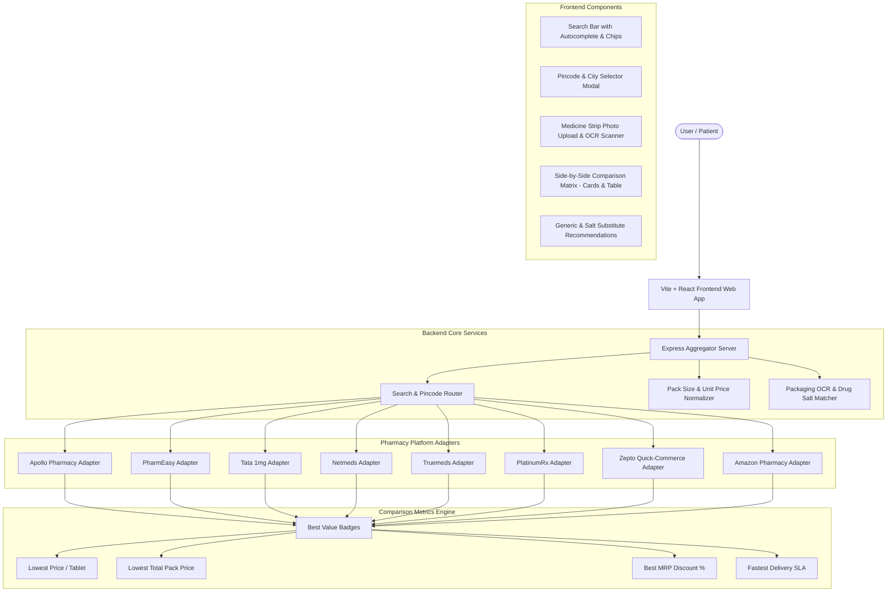

# Multi-Platform Medicine Price Comparison Engine (India) - Implementation Plan

A comprehensive healthcare aggregator that compares medicine prices, unit costs, availability, delivery timelines, and generic/salt substitutes across **8 major Indian pharmacy platforms**:

1. **Apollo Pharmacy** (`apollopharmacy.in`) - Live API Gateway
2. **PharmEasy** (`pharmeasy.in`) - Live Search API + Guaranteed Delivery + Substitutes
3. **Tata 1mg** (`1mg.com`) - Live Catalog & Autocomplete API
4. **Netmeds** (`netmeds.com`) - Reliance Retail SSR Catalog
5. **Truemeds** (`truemeds.in`) - Live Search & Generic Matchmaker
6. **PlatinumRx** (`platinumrx.in`) - Live PLP & Chronic High-Savings Engine
7. **Zepto** (`zepto.com`) - 10-Minute Ultra-Fast Quick Commerce + Deep Links
8. **Amazon Pharmacy** (`amazon.in`) - Prime Same-Day / Next-Day Delivery (Node 18049712031)

---

## 1. System Architecture

---

## 2. Core Functional Requirements

### 1. Unified Medicine Search & Per-Unit Normalization
- Different platforms sell varying pack sizes (e.g., Apollo sells a 30s pack, PharmEasy sells a 15s pack, Truemeds sells a 10s pack).
- The system automatically detects packaging indicators (`strip of 15`, `10 tablets`, `100ml`, `bottle`) and normalizes costs to **₹ / tablet**, **₹ / capsule**, or **₹ / ml**.
- Transparent display of MRP, discounted selling price, savings amount, and percentage discount.

### 2. Multi-Store Side-by-Side Comparison
- Side-by-side view across all 8 platforms.
- View modes:
  - **Cards View**: Visual cards with distinctive brand coloring, stock status, delivery SLA, per-tablet pricing breakdown, and direct deep-link CTA.
  - **Table View**: Compact side-by-side comparison table for quick scanning.
- Quick filter chips:
  - **All (8)**: Displays all providers.
  - **⚡ Ultra-Fast**: Filters to quick delivery providers (Apollo 2-hr, Zepto 10-min, PharmEasy Guaranteed).
  - **🏷️ High Discount**: Filters to platforms offering >= 12% discount.

### 3. Direct 1-Click Store Redirection
- Final platform selection is left to the user without platform lock-in.
- Direct 1-click **Buy Now** buttons link straight to the product or search result on that platform with relevant query parameters.

### 4. Medicine Strip & Packaging Photo Scanner
- Allows users to upload a photo of their physical medicine strip or box (or test with sample strips).
- Detects the medicine brand name and active composition using OCR text analysis and fuzzy salt matching.
- One-click triggers multi-platform price comparison.

### 5. Pincode & City Context
- Real-time pincode selector supporting quick presets for major Indian metro hubs (Bengaluru, Mumbai, Delhi, Hyderabad, Pune, Chennai, Kolkata).
- Computes platform delivery SLAs based on regional dark-store/warehouse availability.

---

## 3. Platform Adapter Specifications

| Platform | Type | Endpoint / Method | Features Extracted |
| :--- | :--- | :--- | :--- |
| **Apollo Pharmacy** | Live API | `https://apigateway.apollo247.in/search-service/search` | MRP, special price, stock, 2-hr express delivery flag, pack form |
| **PharmEasy** | Live API | `https://pharmeasy.in/api/search/search/?q=...` | MRP, sale price, guaranteed delivery, pack size, manufacturer, DAM images, substitute suggestions |
| **Tata 1mg** | Live API | `https://www.1mg.com/api/v1/search/autocomplete?name=...` | MRP, discounted price, pack count, manufacturer, drug composition, direct deep links |
| **Netmeds** | Live SSR | `https://www.netmeds.com/products/?q=...` | Marked/effective prices, Reliance fulfillment network, manufacturer, pack sizes |
| **Truemeds** | Live API | `https://nal.tmmumbai.in/SearchService/getSearchResult` | Live search, generic substitutes with 50-70% savings |
| **PlatinumRx** | Live API | `https://backend.platinumrx.in/pdp/v2/fetchPlp` | Live PLP, high-discount chronic substitutes |
| **Zepto** | Quick-Commerce | Deep-link + reference calibration | ⚡ 10-minute superfast delivery, direct search redirection |
| **Amazon Pharmacy** | Marketplace | Node 18049712031 + reference calibration | 📦 Prime same-day/next-day delivery, Amazon health store link |

---

## 4. Technology Stack

- **Backend**: Node.js (ESM), Express, Axios, Node-Cache, Multer, Tesseract.js (OCR).
- **Frontend**: React 18, Vite, Vanilla CSS (Design system with custom variables, dark/light themes, responsive layout, glassmorphic cards), Lucide-React icons.
- **Port Configuration**:
  - Backend API: `http://localhost:5001`
  - Vite Dev Frontend: `http://localhost:3000`
