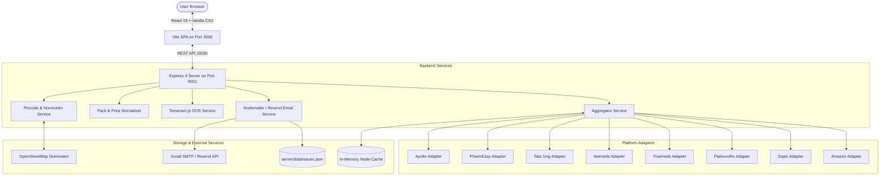

# System Architecture — MedCompare India

> **Technical architecture reference for the MedCompare multi-platform pharmacy aggregation engine.**

---

## 🏗️ System Overview

MedCompare is structured as a decoupled client-server architecture:
- A modern Single-Page Application (SPA) frontend built with **React 19 + Vite 8**.
- A high-throughput, stateless aggregation API built with **Node.js (ES Modules) + Express 4**.

The primary purpose of the system is to normalize varying packaging sizes (e.g., strips of 10 vs. 15 vs. 30 tablets) and delivery models across 8 major Indian pharmacy merchants into comparable per-unit metrics (₹/tablet, ₹/ml) and delivery SLAs.



---

## 🎨 Frontend Architecture

- **Framework**: React 19 SPA bundled by Vite 8.
- **Entry Points**:
  - `client/index.html` — HTML shell with Google Fonts (`Inter` & `Outfit`).
  - `client/src/main.jsx` — React root mount.
  - `client/src/App.jsx` — Central coordinator for global state and layout.
- **Design System (`client/src/index.css`)**:
  - Pure Vanilla CSS utilizing custom CSS properties (`--bg-main`, `--text-main`, `--accent-primary`, etc.).
  - Responsive design supporting mobile (<640px), tablet (640px–1024px), and desktop (>1024px).
  - Theme switching (`data-theme="light"` / `data-theme="dark"`).
- **Core Components (`client/src/components/`)**:
  - `Header.jsx`: Location pill, theme toggle, and modal action triggers.
  - `SearchSection.jsx`: Unified search bar with instant autocomplete, chip presets, and strip scanner launcher.
  - `SearchSuggestions.jsx`: Categorized dropdown distinguishing active salts from brand names with keyboard navigation.
  - `ComparisonMatrix.jsx`: Side-by-side comparison supporting both an interactive horizontal carousel and a comprehensive table view.
  - `ComparisonCard.jsx`: Detailed platform card rendering unit price, savings ribbons, delivery badge, and direct deep link.
  - `MedicineInfoPanel.jsx`: Educational overview of uses, warnings, side effects, and pregnancy safety flags.
  - `SubstituteSection.jsx`: CDSCO-approved generic salt alternatives offering 50%–80% savings.
  - `ReportIssueModal.jsx`: Modal for reporting price discrepancies, pre-populated with current medicine and platform context.
  - `PincodeModal.jsx`: PIN code selector with auto-geolocation trigger and quick-select Indian city presets.
  - `StripScannerModal.jsx`: File upload / camera capture modal that sends packaging photos to `/api/scan-strip`.
- **Client State Management**:
  - Component state handled via standard React hooks (`useState`, `useEffect`, `useRef`, `useCallback`).
  - Browser `localStorage` used for non-sensitive persistent state:
    - `medcompare_user_location`: User's PIN code and city.
    - `medcompare_recent_searches`: Recent search terms (max 5).
    - `medcompare_theme`: Light vs. dark theme selection.
- **API Communication (`client/src/utils/api.js`)**:
  - Dynamic `apiUrl()` helper: Resolves to relative `/api/*` in local development (proxied by Vite) or prepends `VITE_API_BASE_URL` when deployed to static hosting (GitHub Pages).

---

## ⚙️ Backend Architecture

- **Runtime**: Node.js 20 using native ES Modules (`"type": "module"`).
- **Web Framework**: Express 4.
- **Entry Point**: `server/src/index.js` (listens on `PORT` or default 5001).
- **Middleware**:
  - `cors()` for cross-origin requests.
  - `express.json()` for parsing incoming JSON bodies.
- **Routes (`server/src/routes/api.js`)**:
  - `GET /api/search?q=:query&pincode=:pincode`: Aggregates live prices across all 8 platforms.
  - `GET /api/suggestions?q=:query&mode=:mode`: Autocomplete index for medicine names and salts.
  - `GET /api/pincode/lookup?pincode=:pincode`: Resolves city and state for a given PIN code.
  - `GET /api/pincode/reverse-geocode?lat=:lat&lng=:lng`: Reverse-geocodes GPS coordinates to Indian PIN code via Nominatim.
  - `POST /api/scan-strip`: Multipart file upload for OCR text extraction from medicine strip images.
  - `POST /api/report-issue`: Submits user issue, saves to `server/data/issues.json`, and dispatches email via Gmail SMTP / Resend.
  - `GET /api/reports`: Lists logged issues (for inspection).
  - `GET /api/popular-medicines`: Returns pre-cached top searched medicines.
  - `GET /api/popular-compositions`: Returns common composition formulations.

---

## 🔌 Platform Adapters Layer (`server/src/adapters/`)

Each platform adapter is an isolated class or module adhering to a uniform interface:
```javascript
async search(cleanQuery, pincode) => Array<PlatformItem>
```

| Adapter | Source | Implementation Mechanism |
| :--- | :--- | :--- |
| `apollo.js` | Apollo Pharmacy | Live REST API (`https://apollopharmacy.in/...`) |
| `pharmeasy.js` | PharmEasy | Live Search API with brand image & delivery SLA extraction |
| `onemg.js` | Tata 1mg | Live Autocomplete API with formulation & manufacturer extraction |
| `netmeds.js` | Netmeds | SSR Catalog scraping parsing embedded `window.__INITIAL_STATE__` JSON |
| `truemeds.js` | Truemeds | Live generic search API with salt substitution mappings |
| `platinumrx.js` | PlatinumRx | Live PLP catalog with chronic medication discounts |
| `zepto.js` | Zepto | Reference-calibrated 10-minute quick-commerce with direct deep link |
| `amazon.js` | Amazon Pharmacy | Reference-calibrated Prime same-day delivery with deep link |

---

## 📊 Normalization & Metric Calculation (`server/src/services/normalizer.js`)

Different platforms sell drugs in different pack sizes (e.g. 10 tablets, 15 tablets, 30 tablets, 100ml syrup).
The `normalizer` applies regex extraction:
- Detects unit type (`tablet`, `capsule`, `ml`, `bottle`, `strip`).
- Extracts pack size quantity (e.g. "Strip of 15 tablets" -> `packSize = 15`).
- Computes `unitPrice = sellingPrice / packSize`.
- Calculates `discountPercent = ((mrp - sellingPrice) / mrp) * 100`.

The `aggregator` calculates winners:
- 🏆 **Lowest Unit Price**: Lowest cost per tablet/ml.
- ⚡ **Fastest Delivery**: Shortest delivery estimate (10-min, 2-hour, next day).
- 🏷️ **Highest Discount**: Highest percentage savings from MRP.

---

## 🗄️ Persistence & Database Design

The system intentionally avoids heavy database infrastructure:
1. **Runtime Cache**: `node-cache` stores aggregated query results with a 5-minute TTL to reduce redundant outbound HTTP calls.
2. **Issue Reports**: Stored in append-only JSON file [`server/data/issues.json`](file:///home/hrishi/Desktop/Sandeep/MedCompare/server/data/issues.json).
3. **No Authentication**: The application is an open public utility requiring no user login or account management.

---

## 🚀 Deployment Architecture

1. **Frontend**:
   - Built to static assets in `client/dist`.
   - Deployed automatically via GitHub Actions (`.github/workflows/deploy-pages.yml`) to GitHub Pages at `https://raulosandeep93.github.io/MedCompare/`.
   - Dynamic API base URL injected via `VITE_API_BASE_URL` secret.
2. **Backend**:
   - Express server ready for containerized or PaaS hosting (Heroku, Render, AWS EC2, Railway).
   - Root `package.json` contains `heroku-postbuild` and `start` scripts.
